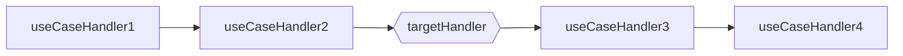
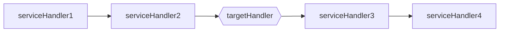

# Framework agnostic request mediator

## Advantages

- written on typescript
- simple and lightweight
- clean API
- supports middlewares as decorators

## Install

```shell script
npm install @ibabkin/ts-request-mediator reflect-metadata
```
```shell script
yarn add @ibabkin/ts-request-mediator reflect-metadata
```

tsconfig.json

```json
{
  "compilerOptions": {
    "experimentalDecorators": true,
    "emitDecoratorMetadata": true
  }
}
```

## Architecture design
### Scopes
- **application**
- **request**
- **useCase**
- **service**

### Request scope

Example:


### Use case scope

Example:


### Service scope


## Usage

### Describe a use case

```typescript
import { IQueryHandler, request, context, transaction, useService } from "@ibabkin/ts-request-mediator";
import { inject } from "ts-constructor-injector";
import { by } from "ts-ioc-container";

@transaction
@request("before", [AuthorizeUser])
@request("after", [LogRequest])
@useCase("before", [SetUserContext])
class CreateTodo implements IQueryHandler<CreateTodoQuery, Todo> {
  constructor(
    @inject(by(ITodoRepositoryKey)) private todoRepository: ITodoRepository,
    @inject(context(IUserKey)) private user: IUser,
    @inject(useService(INotifyAllUsersKey, { transaction: true })) private notifyAllUsers: INotifyAllUsers
  ) {
  }

  @before
  validate(query: CreateTodoQuery): void {
    PermissionError.assert(this.user.isAdmin, "User has no permission to create a todo");
  }

  async handle(query: CreateTodoQuery): Promise<Todo> {
    const todo = await this.todoRepository.create(query);
    return todo;
  }

  @after
  async notify(query: CreateTodoQuery, todo: Todo): Promise<void> {
    await this.notifyAllUsers.handle(todo);
  }
}

const INotifyAllUsersKey = Symbol("INotifyAllUsers");
interface INotifyAllUsers extends IQueryHandler<Todo, void> {
}

class NotifyAllUsers implements INotifyAllUsers {
  constructor(
    @inject(by(INotificationServiceKey)) private notificationService: INotificationService
  ) {
  }

  async handle(todo: Todo): Promise<void> {
    const users = await this.userRepository.findAll();
    await this.notificationService.notify(users, `New todo created: ${todo.title}`);
  }
}

```

### Wrap your dependency container into adapter

```typescript

import { IDependencyContainer } from '@ibabkin/ts-ioc-container';

export class ContainerAdapter implements IDependencyContainer {
  constructor(private container: IContainer) {}

  createScope(tags: string[]): IDependencyContainer {
    return new ContainerAdapter(this.container.createScope(tags));
  }

  dispose(): void {
    this.container.dispose();
  }

  registerValue(key: string | symbol, value: unknown): void {
    this.container.register(fromValue(value).forKey(key).build());
  }

  resolve<T>(key: constructor<T> | symbol): T {
    return this.container.resolve(key);
  }
}

```

### Create mediator

```typescript

const mediator = new RequestMediator(new ContainerAdapter(container));

```

### And finally invoke your use case

```typescript
const todo = await mediator.send(CreateTodo, {title: 'Buy milk', description: '2% fat'});
```

## Implement your transaction context and put into DI container

```typescript
import { PrismaClient } from '@prisma/client';
import { Fn } from '@ibabkin/ts-constructor-injector';
import { forKey, Resolveable } from '@ibabkin/ts-ioc-container';
import { ITransactionContextKey, ITransactionContext } from '@ibabkin/ts-request-mediator';
import { perApplication } from '../../core/di';

@perApplication
@forKey(ITransactionContextKey)
export class PrismaTransactionContext implements ITransactionContext {
  constructor(public dbClient: PrismaClient = new PrismaClient()) {}

  execute<Response>(setContext: (context: ITransactionContext) => Promise<Response>): Promise<Response> {
    return this.dbClient.$transaction((transactionClient) =>
      setContext(new PrismaTransactionContext(transactionClient as PrismaClient)),
    );
  }
}

export const prismaClient: Fn<Resolveable, PrismaClient> = (l) =>
  l.resolve<PrismaTransactionContext>(ITransactionContextKey).dbClient;

```
