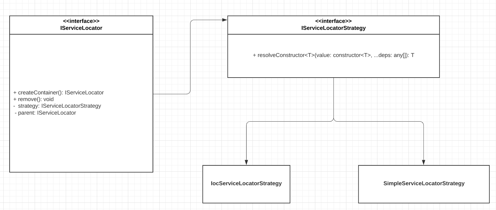

# Typescript IoC and service locator container :boom: :100: :green_heart:

## Advantages
- written on typescript
- simple and lightweight (roughly it's just one file of **~120 lines**) :heart:
- clean API
- supports scopes
- can be used with decorators `@inject`
- provides auto-factories
- supports `postConstruct` and `dispose` instance hooks
- composable and open to extend
- can be used with `unit-test-ts-ioc-container`

## Architecture


## Install
```shell script
npm install ts-ioc-container
```
```shell script
yarn add ts-ioc-container
```
Add `reflect-metadata` if you want to use decorators
```shell script
npm install reflect-metadata
```
```shell script
yarn add reflect-metadata
```

## Usage
How to create new container
```typescript
import {ServiceLocatorFactory} from 'ts-ioc-container';

const container = new ServiceLocatorFactory().createIoCLocator();
container.registerConstructor('ILogger', Logger, {resolving: 'singleton'});
container.registerConstructor('ISticker', Sticker);

const repository = container.resolve(StickerRepository);
repository.addSticker('Go to shop', 'Buy milk, tea and watermelon');
```
How to destroy container
```typescript
container.remove();
```
How to inject dependencies
```typescript
import {inject, Factory} from 'ts-ioc-container';

class StickerRepository {
  private stickers: ISticker;

  constructor(
    @inject('ILogger') private logger: ILogger,
    @inject(Factory('ISticker')) private stickerFactory: (...args: any[]) => ISticker, // auto-factory (no need to register it)
  ) {}

  createSticker(title: string, body: string) {
    this.stickers.push(this.stickerFactory(title, body));
  }
}
```
How to register dependency
```typescript
container.registerConstructor('ILogger', Logger, {resolving: 'singleton'});
container.registerInstance('IConfig', {itemsMaxCount: 20});
container.registerFunction('IStickerFactory', (l, title, body, ...args: any[]) => l.resolve('ISticker', title, body, ...args));

// to override just register again
container.registerInstance('IConfig', {itemsMaxCount: 22});
```
How to resolve dependency
```typescript
container.resolve('ISticker', ...['Go to shop', 'Buy milk, tea and watermelon'])
```
How to check dependency for existence
```typescript
container.has('ISticker');
```

### Scoped containers
```typescript
import {ServiceLocatorFactory} from 'ts-ioc-container';

const container = new ServiceLocatorFactory().createIoCLocator();
container.registerConstructor('ILogger', Logger, {resolving: 'perScope'});
const scopedContainer = container.createContainer();
const logger = scopedContainer.resolve('ILogger');
logger.log('Hello');
scopedContainer.remove();
```

### Instance hooks
By implementing `IInjectable` interface
```typescript
export interface IInjectable {
    dispose?(): void;
    postConstruct?(): void;
}
```
```typescript
import {IInjectable} from 'ts-ioc-container';

class Logger implements IInjectable {
    postConstruct(): void {
        console.log('initialized');
    }

    dispose(): void {
        console.log('destroyed');
    }
}
```

### Types of containers
SimpleLocator (cannot be used with decorators)
```typescript
const container = new ServiceLocatorFactory().createSimpleLocator();
```
IoC container (work based on decorators)
```typescript
const container = new ServiceLocatorFactory().createIoCLocator();
```

### Tests
Use [unit-test-ts-ioc-container](https://github.com/IgorBabkin/service-locator/tree/master/packages/unit-test-ts-ioc-container)
```typescript
import {Mock} from 'moq.ts';
import {ServiceLocatorFactory} from 'ts-ioc-container';
import {UnitTestServiceLocatorFactory, MoqAdapter, MoqAdapter} from 'unit-test-ts-ioc-container';

const container = new ServiceLocatorFactory().createIoCLocator();
const mockFactory = () => new MoqAdapter(new Mock());
const unitTestContainer = new UnitTestServiceLocatorFactory(mockFactory).create(container);

const stickerMock = unitTestContainer.resolveMock('ISticker');
stickerMock.setup(i => i.title).return('Sticker title');
```
